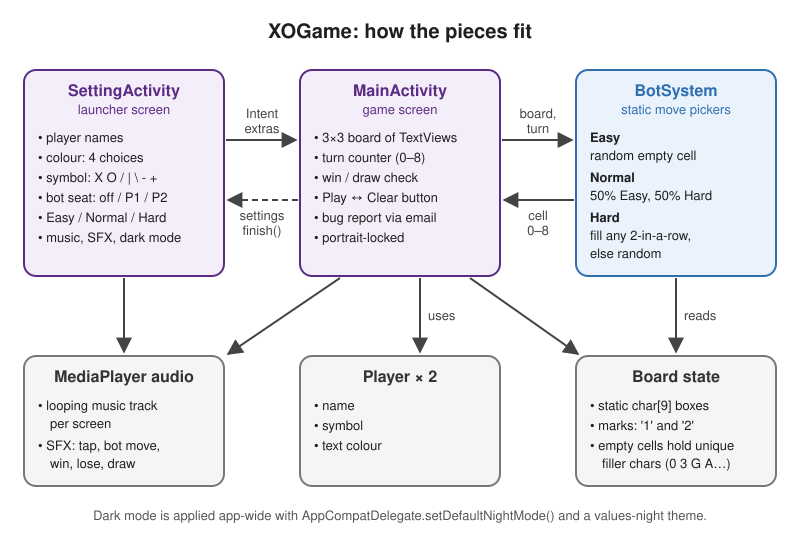

<p align="center">
  
</p>

<h1 align="center">XOGame</h1>

<p align="center">
  Tic-tac-toe for Android with a three-level bot, local multiplayer, custom players, music and dark mode.
</p>

<p align="center">
  
  
  
  
  
</p>

My first Android app (2022–2023), written in Java with XML layouts. It's a complete, playable game, and the code shows where I started before the [rewrite](#whats-next).

## Preview

https://user-images.githubusercontent.com/38864734/217934376-56ca4621-b14d-4434-97e1-a9225133da69.mp4

**[Download the APK (v1.1)](https://github.com/darsh-7/XOGame/releases/download/1.1/XO.Game.apk)**

## Features

- **Play against a bot** on Easy, Normal or Hard. The bot can take either seat, so it can move first (Player 1) or second (Player 2).
- **Local two-player mode**: turn the bot off and pass the phone.
- **Custom players**: set each player's name, symbol (`X O / | \ - +`) and colour (black, blue, red, yellow).
- **Music and sound effects**: a looping track on each screen, plus sounds for taps, bot moves, win, lose and draw. Music and SFX each have their own toggle.
- **Dark mode**: a switch in settings flips the app-wide DayNight theme.
- **Bug report button**: opens the user's email app with a pre-filled report template.

## How the bot works

The board is a `char[9]`. Each player's marks are stored as `'1'` or `'2'`, and every empty cell holds its own filler character (`'0','3','G','A','M','E','9','8','7'`). Since no two filler characters are equal, "these three cells are equal" is only true for real marks. The same check drives both the win detector and the bot.

| Level  | Strategy (`BotSystem.java`) |
|--------|-----------------------------|
| Easy   | Picks a random empty cell. |
| Normal | Each move, a 50/50 coin flip: play like Easy or play like Hard. |
| Hard   | Scans the 8 winning lines. If any line has two matching marks and an empty third cell, it takes that cell, which either wins or blocks. If no line qualifies, it plays a random empty cell. |

Hard is a one-move heuristic. It has no lookahead and doesn't prefer winning over blocking, so a player who sets up two threats at once (a fork) can still beat it. The rewrite replaces it with full minimax.

## Architecture

<p align="center">
  
</p>

- **`SettingActivity`** is the launcher. It collects names, colours, symbols, the bot seat, difficulty and the audio toggles, then starts the game with them as `Intent` extras.
- **`MainActivity`** runs the match. It handles the 3×3 board, the turn counter, win/draw detection and sounds. On the bot's turn it asks `BotSystem` for a cell index. The settings button calls `finish()` to go back.
- **`BotSystem`** holds the three static move pickers described above.
- **`Player`** stores a player's name, symbol and text colour.

## Tech stack

| | |
|---|---|
| Language | Java (source/target 1.8) |
| UI | XML layouts, ConstraintLayout, Material Components (DayNight theme) |
| Libraries | AndroidX AppCompat 1.4.2, Material 1.6.1, ConstraintLayout 2.1.4 |
| Audio | `android.media.MediaPlayer` |
| Build | Android Gradle Plugin 7.4.0, compileSdk / targetSdk 32, minSdk 26 |

## Project structure

```
app/src/main/
├── java/com/example/xogame/
│   ├── SettingActivity.java   # launcher: player setup, bot, audio, dark mode
│   ├── MainActivity.java      # board, turns, win/draw check, sounds
│   ├── BotSystem.java         # Easy / Normal / Hard move selection
│   └── Player.java            # name, symbol, colour
└── res/
    ├── layout/                # settings screen + game screen
    ├── layout-v31/            # Android 12+ variant of the game screen
    ├── raw/                   # music tracks and sound effects
    └── values-night/          # dark theme colours
docs/architecture.svg
```

## Getting started

**Requirements:** Android Studio Electric Eel (2022.1) or newer with JDK 11+ (needed by AGP 7.4), Android SDK 32, and a device or emulator running Android 8.0 (API 26) or higher.

```bash
git clone https://github.com/darsh-7/XOGame.git
```

Open the folder in Android Studio, let Gradle sync, and run the `app` configuration. The repo doesn't include `gradle-wrapper.properties`, so build from Android Studio instead of `./gradlew`.

If you just want to play, install the [prebuilt APK](https://github.com/darsh-7/XOGame/releases/download/1.1/XO.Game.apk).

## What's next

A rewritten version is coming to Google Play. It uses Java 17 and Material 3 with dynamic colour, has an unbeatable minimax AI, and supports 13 languages.

## Author

**Mostafa Ahmed**: [GitHub @darsh-7](https://github.com/darsh-7) · [LinkedIn](https://www.linkedin.com/in/darsh7/)

Licensed under the [Apache License 2.0](license).
